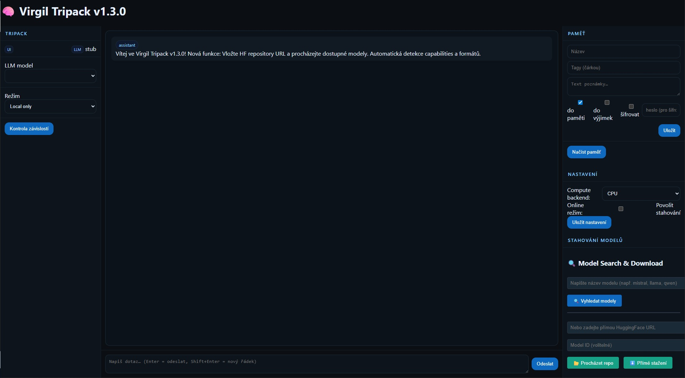

# 🌟 Virgil – nová větev AI

*✨ Pojďme z toho udělat cestu.*

Virgil je lokální AI asistent, který běží plně na vašem počítači.  

Je rychlý, flexibilní, český a připravený nejen pro školy, instituce a laboratoře.  

Vznikl z čisté vášně pro technologie – jako další z mých projektů, na kterých pracuji už více než 20 let.

## 🎬 Animovaná ukázka v1.6.0

Prohlédněte si animovanou ukázku nových funkcí Virgil v1.6.0:
**[🎬 Zobrazit animovanou ukázku](https://github.com/avv217/Projekt-Virgil/raw/main/ukázka%20verze%201.6.gif)**

*Tato ukázka představuje:*
- 🛠️ Pokročilé nastavení modelu s posuvníky
- 🎨 Preset profily (Profesionální, Kreativní, Technický)
- 📊 České nápovědy k parametrům
- ⚡ Rychlý test nastavení

---

## 🎮 Vyzkoušet demo

Než si stáhnete aplikaci, vyzkoušejte interaktivní demo UI:  

**[🖥️ Zkusit Virgil Demo](https://avv217.github.io/Projekt-Virgil)**

Demo ukazuje skutečné rozhraní aplikace – můžete klikat na tlačítka, měnit nastavení a vidět, jak aplikace funguje.

---

## ✨ Kdo jsem:

Jsem nezávislý vývojář a technologický nadšenec.  

Elektroniku a programování modifikuji už od svých 10 let.  

Od té doby jsem vytvořil řadu menších projektů, které mě krok za krokem dovedly až sem – k Virgilu a dalším, které teprve přijdou.  

❌ Nejsem korporace.  

❌ Nejsem konkurence.  

✅ Jsem novou větví – nezávislou, otevřenou, tvořenou srdcem a vizí.  

---

## 🚀 Co Virgil umí:

- ✅ 🧠  Multi-session chat s pamětí  

- ✅ 🔄  Inteligentní CPU/GPU switching (až 25× zrychlení)  

- ✅ 🇨🇿   Plná česká lokalizace (UI i AI odpovědi)  

- ✅ 🏫  Školní use-case – připravený pro vzdělávací prostředí  

- ✅ 📥  Podpora GGUF modelů + integrace s HuggingFace  

- ✅ 🔧  Otevřený vývoj – každý release je funkční a testovaný

---

## 🌌 Další možnosti využití:

Virgil není jen AI pro psaní textů.  

Díky své flexibilitě se může časem uplatnit i v oblastech, jako jsou:

- 🔭 Astronomie – analýza dat, hledání vzorců a anomálií ve vesmírných měřeních  

- 📡 RTL-SDR a signály – zpracování a interpretace dat z rádiových přijímačů  

- 💻 Vývoj kódu – pomoc s tvorbou i opravami software, včetně vlastního zdokonalování  

- 🧪 Výzkum – podpora nezávislých experimentátorů a laboratoří  

Tyto směry ukazují, že Virgil může růst nejen jako osobní AI asistent,  

ale i jako nástroj pro vědu, výzkum a technologický pokrok.

---

## 🎯 Kam momentálně směřuji a co je cílem?:

          >> Virgil je jen začátek <<

- 🚀 Rozšířit Virgil o nové funkce a stabilní edice které jsou praktické 

- 🌍 Posunout projekt do širší komunity  

- 🔄 Pokračovat v dalších projektech, které budou nejen navazovat  

❌ Nejsem konkurent

✅ Chci ukázat, že i jednotlivec může vytvořit vlastní cestu.  

---

## 💡 Proč hledám podporu:

Virgil dokazuje, že i jednotlivec může postavit AI nástroj, který obstojí vedle velkých řešení.  

Ale tohle jsou jen první kroky. 

